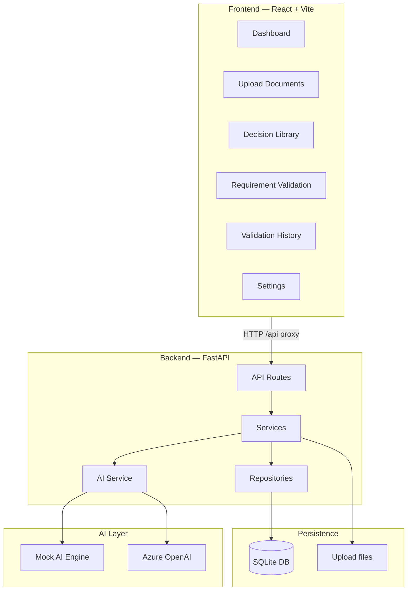
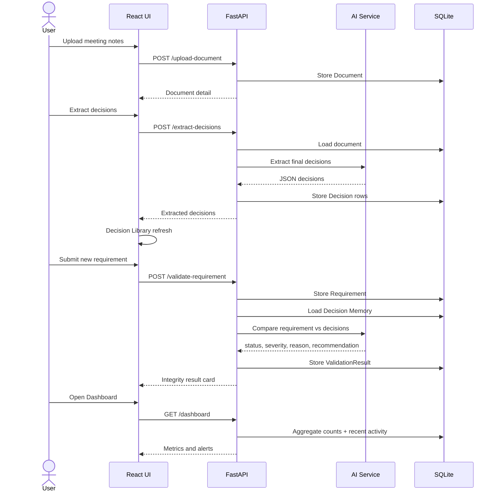
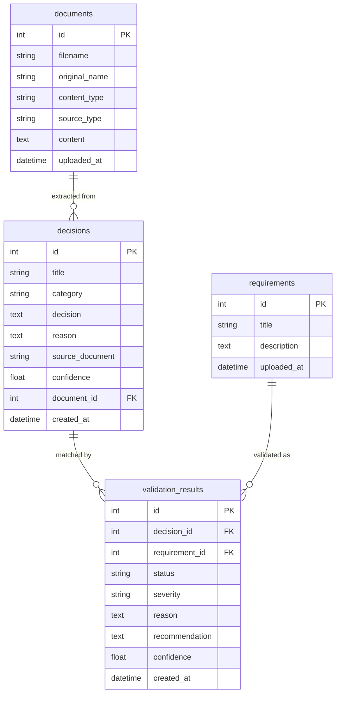

# AI Guardian

**Project Decision Integrity Engine**

AI Guardian prevents project decision conflicts *before* implementation. It extracts final decisions from project documents, builds a Decision Memory, and validates new requirements for conflicts, duplicates, and decision drift.

> Hackathon MVP of the **Project Guardian** vision: a proactive integrity engine—not a chatbot—that protects project knowledge when new work enters the system.

---

## Table of Contents

1. [Project Overview](#project-overview)
2. [Technology Stack](#technology-stack)
3. [Architecture](#architecture)
4. [End-to-End Process Flow](#end-to-end-process-flow)
5. [Use Cases](#use-cases)
6. [Project Structure](#project-structure)
7. [Prerequisites](#prerequisites)
8. [Environment Configuration](#environment-configuration)
9. [Installation Guide](#installation-guide)
10. [Running the Application](#running-the-application)
11. [Sample Data](#sample-data)
12. [API Documentation](#api-documentation)
13. [Database Schema](#database-schema)
14. [Troubleshooting](#troubleshooting)
15. [Hackathon Scope](#hackathon-scope)
16. [Future Enhancements](#future-enhancements)
17. [5-Minute Demo Script](#5-minute-demo-script)

---

## Project Overview

### Project name

**AI Guardian** (Decision Integrity Engine)

### Business problem being solved

In real delivery programs, critical decisions disappear into meetings, chats, and emails. Later, teams:

1. **Lose decisions** — approved choices are forgotten.
2. **Duplicate conversations** — the same questions are debated again.
3. **Allow decision drift** — new requirements quietly diverge from what was already approved.

Most AI tools are *reactive* (ask a question → get an answer). Projects need something *proactive*:

```
New information enters the project
        ↓
AI compares it against Decision Memory
        ↓
Conflicts / duplicates / drift are detected
        ↓
Team is warned before work continues
```

### Solution overview

AI Guardian is a local web application that:

1. Accepts uploaded project documents (simulating Teams / Jira / GitHub / Outlook events).
2. Uses Azure OpenAI (or a deterministic **mock AI** for demos) to extract **final** project decisions only.
3. Stores them in SQLite as **Decision Memory**.
4. Validates new requirements against that memory.
5. Surfaces severity, confidence, reason, and recommendations on a Fluent-inspired dashboard.

No live Jira, GitHub, Teams, or Confluence integrations are required for the hackathon MVP.

### Key features

| Feature | Description |
|---------|-------------|
| Document upload | Upload `.txt` / `.md` meeting notes and project artifacts |
| AI decision extraction | Extract only final decisions; ignore discussions and questions |
| Decision Library | Searchable Decision Memory with confidence and source |
| Requirement validation | Compare a new requirement to stored decisions |
| Conflict detection | Flag contradictions (e.g., guest checkout vs Azure AD-only) |
| Duplicate detection | Flag reopened / restated decisions |
| Decision drift detection | Flag gradual divergence (e.g., GraphQL vs REST) |
| Dashboard | Counts, open risks, recent validations and decisions |
| Settings | Toggle mock AI vs Azure OpenAI |
| Validation history | Persist and review past integrity checks |

---

## Technology Stack

| Layer | Technology |
|-------|------------|
| Backend | Python 3.11+ (3.12 recommended), FastAPI, Uvicorn, SQLAlchemy, Pydantic |
| Frontend | React 19, Vite, TypeScript, Tailwind CSS v4, Axios, TanStack React Query, React Router |
| Database | SQLite (`database/guardian.db`) |
| AI | Azure OpenAI (GPT deployment) with local mock fallback |
| Tooling | npm, python-multipart (uploads) |

---

## Architecture

### High-level architecture



### Component responsibilities

| Component | Responsibility |
|-----------|----------------|
| **React frontend** | Fluent-inspired dashboard UI; calls backend via Axios + React Query |
| **FastAPI routes** | HTTP surface (`/upload-document`, `/extract-decisions`, `/validate-requirement`, etc.) |
| **Services** | Business logic: upload, extraction, validation, dashboard, settings |
| **Repositories** | SQLAlchemy data access for documents, decisions, requirements, validations |
| **AI Service** | Prompt orchestration; routes to Azure OpenAI or mock heuristics |
| **SQLite** | Durable Decision Memory and validation history |
| **Uploads folder** | Stored copies of uploaded text documents |
| **Settings** | Persist `USE_MOCK_AI` and Azure credentials to `.env` |

### How frontend, backend, database, and Azure OpenAI interact

1. The Vite dev server serves the UI on port **5173** and proxies `/api/*` → `http://127.0.0.1:8000`.
2. FastAPI authenticates nothing in MVP (local demo) and processes requests through clean-architecture layers.
3. Documents and decisions are written to SQLite; file bytes/text are also saved under `backend/uploads/`.
4. When `USE_MOCK_AI=true` **or** Azure credentials are missing, the AI Service uses deterministic mock logic suitable for demos.
5. When `USE_MOCK_AI=false` **and** endpoint + API key are configured, extraction and validation call Azure OpenAI chat completions with JSON response format.

### Backend clean architecture

```
Routes → Services → Repositories → Models (SQLAlchemy)
                 ↘ AI Service → prompts + Azure/mock
Schemas (Pydantic) define API contracts
```

---

## End-to-End Process Flow

### Workflow overview



### Step-by-step narrative

1. **Document upload** — User uploads a meeting transcript or artifact (source type: Teams / Jira / GitHub / Outlook / other).
2. **AI decision extraction** — Prompt 1 extracts only *final* decisions (title, category, decision, reason, confidence).
3. **Decision storage** — Decisions are saved in SQLite and shown in the Decision Library.
4. **Requirement validation** — User pastes or loads a new requirement.
5. **Conflict / duplicate / drift detection** — Prompt 2 (or mock rules) classifies the outcome.
6. **Explanation & recommendation** — UI shows severity, confidence, existing decision, new requirement, reason, and corrective action.
7. **Dashboard updates** — Counts of conflicts, drifts, duplicates, and open risks refresh from `/dashboard`.

---

## Use Cases

### 1. Decision extraction from meeting notes

- **Input:** `sample_documents/teams_sprint_planning_notes.txt`
- **Action:** Upload → Extract decisions
- **Output:** Decisions such as Azure AD OAuth, PostgreSQL, Stripe-only payments, REST partner APIs

### 2. Requirement validation

- **Input:** A new requirement title + description
- **Action:** Validate against Decision Memory
- **Output:** Structured integrity result persisted in history

### 3. Conflict detection

| Sample | Why it conflicts |
|--------|------------------|
| Guest checkout without Azure AD | Contradicts Azure AD OAuth-only auth decision |
| Add PayPal for launch | Contradicts Stripe-only payment decision |

### 4. Duplicate decision detection

- **Sample:** Confirm Stripe payment decision (“already decided / as agreed”)
- **Result:** `duplicate` — close the thread; link to existing Decision Memory entry

### 5. Decision drift detection

- **Sample:** Introduce GraphQL for partners
- **Result:** `drift` — diverges from approved versioned REST APIs without an explicit decision change

### 6. Dashboard and reporting

- Open risks = conflicts + drifts
- Recent validations and Decision Memory snapshot
- System health and effective AI mode (mock vs Azure OpenAI)

---

## Project Structure

```
AI_Guardian/
├── README.md                 # This guide
├── Hackathon Idea.docx       # Original product vision
├── .gitignore
├── backend/
│   ├── .env                  # Local secrets (not committed)
│   ├── .env.example          # Template
│   ├── requirements.txt
│   ├── uploads/              # Stored uploaded files
│   └── app/
│       ├── main.py           # FastAPI app factory + lifespan
│       ├── api/routes/       # HTTP endpoints
│       ├── core/             # Config + database engine
│       ├── models/           # SQLAlchemy entities
│       ├── schemas/          # Pydantic request/response models
│       ├── repositories/     # Data access
│       ├── services/         # Business + AI orchestration
│       ├── prompts/          # Runtime AI prompts
│       └── utils/
├── frontend/
│   ├── package.json
│   ├── vite.config.ts        # Dev server + /api proxy
│   ├── index.html
│   └── src/
│       ├── api/client.ts     # Axios API client
│       ├── components/       # AppShell layout
│       └── pages/            # Dashboard, Upload, Library, Validate, History, Settings
├── database/
│   └── guardian.db           # Created at runtime
├── sample_documents/         # Demo inputs (Teams/Jira/Outlook)
├── sample_requirements/      # Demo validation scenarios
├── prompts/                  # Human-readable prompt drafts
└── reports/                  # Reserved for future report exports
```

### Important backend packages

| Path | Purpose |
|------|---------|
| `app/api/routes/*.py` | Route handlers per domain |
| `app/services/ai_service.py` | Extraction + validation AI (Azure/mock) |
| `app/services/decision_service.py` | Extract and list decisions |
| `app/services/validation_service.py` | Validate requirements + history |
| `app/services/dashboard_service.py` | Aggregated metrics |
| `app/services/settings_service.py` | Read/write `.env` settings |
| `app/prompts/` | System/user prompts for GPT |

---

## Prerequisites

| Requirement | Version / notes |
|-------------|-----------------|
| Python | **3.11+** (3.12 recommended) |
| Node.js | **20+** (tested with 24.x) |
| npm | **10+** (ships with Node) |
| Git | Optional but recommended |
| Azure OpenAI | Optional for demos (mock AI works offline) |

### Azure OpenAI (optional)

To use live models you need:

- An Azure OpenAI (or Azure AI Foundry) resource
- A chat model deployment (e.g. `gpt-4o`)
- Endpoint URL + API key

If these are missing, leave mock AI enabled.

---

## Environment Configuration

Configuration lives in `backend/.env` (created from `.env.example`, or saved via the Settings page).

### Sample `.env`

```env
# true = deterministic mock AI (recommended for hackathon demos)
USE_MOCK_AI=true

# Allowed browser origins for CORS
CORS_ORIGINS=http://localhost:5173,http://127.0.0.1:5173

# Azure OpenAI — required only when USE_MOCK_AI=false
AZURE_OPENAI_ENDPOINT=https://YOUR_RESOURCE.openai.azure.com/
AZURE_OPENAI_API_KEY=YOUR_KEY_HERE
AZURE_OPENAI_DEPLOYMENT=gpt-4o
AZURE_OPENAI_API_VERSION=2024-08-01-preview
```

### Variable reference

| Variable | Required | Description |
|----------|----------|-------------|
| `USE_MOCK_AI` | Yes | `true` forces mock AI. Even if `false`, mock is used when Azure is not fully configured. |
| `CORS_ORIGINS` | Yes | Comma-separated frontend origins |
| `AZURE_OPENAI_ENDPOINT` | For live AI | Azure OpenAI resource endpoint |
| `AZURE_OPENAI_API_KEY` | For live AI | API key (never returned by Settings API) |
| `AZURE_OPENAI_DEPLOYMENT` | For live AI | Deployment / model name |
| `AZURE_OPENAI_API_VERSION` | For live AI | API version string |
| `DATABASE_URL` | No | Defaults to `database/guardian.db` under the project root |
| `UPLOAD_DIR` | No | Defaults to `backend/uploads` |

Effective AI mode rule:

```
should_use_mock = USE_MOCK_AI OR (missing endpoint/key)
```

---

## Installation Guide

### 1. Clone / open the repository

```bash
# If using Git
git clone <your-repo-url> AI_Guardian
cd AI_Guardian
```

Or open the `AI_Guardian` folder directly in your IDE.

### 2. Backend setup

**Windows (PowerShell)**

```powershell
cd backend
python -m venv .venv
.\.venv\Scripts\Activate.ps1
pip install -r requirements.txt
copy .env.example .env
```

**macOS / Linux**

```bash
cd backend
python3 -m venv .venv
source .venv/bin/activate
pip install -r requirements.txt
cp .env.example .env
```

### 3. Database configuration

No manual migration step is required. On API startup, SQLAlchemy creates tables in:

```
database/guardian.db
```

### 4. Frontend setup

**Windows / macOS / Linux**

```bash
cd frontend
npm install
```

### 5. Configure Azure OpenAI (optional)

1. Edit `backend/.env`, **or**
2. Start the app and open **Settings** in the UI:
   - Uncheck **Use mock AI**
   - Enter endpoint, API key, deployment, API version
   - Save

Keep mock AI enabled unless you intend to call Azure during the demo.

---

## Running the Application

Run **backend** and **frontend** in two terminals.

### Start the backend

**Windows**

```powershell
cd backend
.\.venv\Scripts\Activate.ps1
uvicorn app.main:app --reload --host 127.0.0.1 --port 8000
```

**macOS / Linux**

```bash
cd backend
source .venv/bin/activate
uvicorn app.main:app --reload --host 127.0.0.1 --port 8000
```

- Health: [http://127.0.0.1:8000/health](http://127.0.0.1:8000/health)
- Interactive API docs: [http://127.0.0.1:8000/docs](http://127.0.0.1:8000/docs)

### Start the frontend

```bash
cd frontend
npm run dev
```

- UI: [http://127.0.0.1:5173](http://127.0.0.1:5173)  
  (or [http://localhost:5173](http://localhost:5173))

Vite proxies `/api/*` to the backend, so the browser never needs to call port 8000 directly during normal UI use.

### Verify quickly

```bash
# Backend health
curl http://127.0.0.1:8000/health

# Through frontend proxy
curl http://127.0.0.1:5173/api/health
```

---

## Sample Data

### Meeting / project documents — `sample_documents/`

| File | Simulated source | Purpose |
|------|------------------|---------|
| `teams_sprint_planning_notes.txt` | Microsoft Teams | Primary decision extraction demo (4 final decisions) |
| `jira_guest_checkout_story.txt` | Jira | Story that conflicts with Azure AD-only auth |
| `outlook_paypal_request.txt` | Outlook | Email requesting PayPal (conflicts with Stripe-only) |

### Requirements — `sample_requirements/`

| File | Expected result |
|------|-----------------|
| `conflict_guest_checkout.txt` | Conflict |
| `conflict_paypal.txt` | Conflict |
| `duplicate_stripe_confirm.txt` | Duplicate |
| `drift_graphql.txt` | Drift |
| `no_conflict_email_template.txt` | No conflict |

### How to use them

1. Open **Upload Documents**.
2. Upload `teams_sprint_planning_notes.txt` (source: Teams meeting notes).
3. Click **Extract decisions**.
4. Open **Requirement Validation** and click the sample chips (Guest checkout, PayPal, GraphQL, etc.).
5. Review results on **Validation History** and **Dashboard**.

---

## API Documentation

Base URL (direct): `http://127.0.0.1:8000`  
Base URL (via Vite): `http://127.0.0.1:5173/api`

Interactive OpenAPI UI: [http://127.0.0.1:8000/docs](http://127.0.0.1:8000/docs)

### Endpoint summary

| Method | Path | Description |
|--------|------|-------------|
| GET | `/health` | Liveness + DB + AI mode |
| POST | `/upload-document` | Upload a document (`multipart/form-data`) |
| GET | `/documents` | List uploaded documents |
| GET | `/documents/{id}` | Document detail + content |
| POST | `/extract-decisions` | Extract & store decisions for a document |
| GET | `/decisions` | List Decision Memory (`?document_id=` optional) |
| POST | `/validate-requirement` | Validate a requirement against memory |
| GET | `/validation-history` | Past validation results |
| GET | `/dashboard` | Aggregate metrics + recent activity |
| GET | `/settings` | Current AI configuration (key masked) |
| PUT | `/settings` | Update mock/Azure settings |

### Examples

#### Health

```http
GET /health
```

```json
{
  "status": "ok",
  "app": "AI Guardian",
  "database": "ok",
  "ai_mode": "mock"
}
```

#### Upload document

```bash
curl -X POST http://127.0.0.1:8000/upload-document \
  -F "file=@sample_documents/teams_sprint_planning_notes.txt" \
  -F "source_type=meeting_notes"
```

Response (trimmed):

```json
{
  "id": 1,
  "original_name": "teams_sprint_planning_notes.txt",
  "source_type": "meeting_notes",
  "content": "...",
  "preview": "..."
}
```

#### Extract decisions

```bash
curl -X POST http://127.0.0.1:8000/extract-decisions \
  -H "Content-Type: application/json" \
  -d "{\"document_id\": 1, \"replace_existing\": true}"
```

```json
{
  "document_id": 1,
  "document_name": "teams_sprint_planning_notes.txt",
  "ai_mode": "mock",
  "removed_existing": 0,
  "extracted_count": 4,
  "decisions": [
    {
      "id": 1,
      "title": "Use Azure AD OAuth for all user authentication",
      "category": "Security / Authentication",
      "decision": "...",
      "reason": "...",
      "confidence": 0.92,
      "source_document": "teams_sprint_planning_notes.txt",
      "document_id": 1,
      "created_at": "2026-07-14T13:50:00"
    }
  ]
}
```

#### Validate requirement

```bash
curl -X POST http://127.0.0.1:8000/validate-requirement \
  -H "Content-Type: application/json" \
  -d "{\"title\": \"Guest checkout without account creation\", \"description\": \"Allow guest checkout with email only and no Azure AD / SSO.\"}"
```

```json
{
  "ai_mode": "mock",
  "requirement": {
    "id": 1,
    "title": "Guest checkout without account creation",
    "description": "...",
    "uploaded_at": "2026-07-14T13:55:00"
  },
  "validation": {
    "id": 1,
    "decision_id": 1,
    "requirement_id": 1,
    "status": "conflict",
    "severity": "critical",
    "reason": "...",
    "recommendation": "...",
    "confidence": 0.94,
    "created_at": "2026-07-14T13:55:00"
  },
  "matched_decision": { "id": 1, "title": "Use Azure AD OAuth for all user authentication", "...": "..." },
  "existing_decision": "...",
  "new_requirement": "..."
}
```

Validation `status` values: `conflict` | `duplicate` | `drift` | `no_conflict`  
Severity values: `none` | `low` | `medium` | `high` | `critical`

#### Dashboard

```http
GET /dashboard
```

Returns totals, open risks, breakdown counts, `recent_validations`, and `recent_decisions`.

#### Settings

```http
GET /settings
PUT /settings
Content-Type: application/json

{
  "use_mock_ai": true,
  "azure_openai_endpoint": "https://YOUR_RESOURCE.openai.azure.com/",
  "azure_openai_api_key": "optional-if-unchanged",
  "azure_openai_deployment": "gpt-4o",
  "azure_openai_api_version": "2024-08-01-preview"
}
```

Leave `azure_openai_api_key` omitted to keep the existing key.

---

## Database Schema

SQLite file: `database/guardian.db`



### Table purposes

| Table | Purpose |
|-------|---------|
| `documents` | Uploaded project artifacts and full text content |
| `decisions` | Decision Memory — final extracted project decisions |
| `requirements` | New requirements submitted for integrity checks |
| `validation_results` | Saved outcomes of each validation run |

### Relationships

- One **document** → many **decisions**
- One **requirement** → many **validation_results** (re-runs allowed)
- One **decision** → many **validation_results** (optional match via `decision_id`)

---

## Troubleshooting

### Common setup issues

| Symptom | Likely cause | Fix |
|---------|--------------|-----|
| Blank / white UI | Stale Vite HMR + type-import crash | Hard refresh (`Ctrl+Shift+R`). Restart `npm run dev`. |
| `ECONNREFUSED` on `/api/*` | Backend not running | Start uvicorn on port 8000 |
| Port 8000 already in use | Orphaned uvicorn worker | Kill Python processes using the port, then restart backend |
| `ModuleNotFoundError: app` | Wrong working directory | Run uvicorn from `backend/` with venv activated |
| Frontend proxy 404 for new routes | Old backend process | Restart uvicorn after pulling new routes |

**Windows — free port 8000**

```powershell
netstat -ano | findstr :8000
# Note the PID of LISTENING rows, then:
taskkill /F /PID <pid>
```

If PIDs look stale, also kill multiprocessing children:

```powershell
Get-CimInstance Win32_Process -Filter "Name='python.exe'" |
  Where-Object { $_.CommandLine -match 'uvicorn|multiprocessing' } |
  ForEach-Object { taskkill /F /PID $_.ProcessId }
```

### Azure OpenAI configuration issues

| Symptom | Fix |
|---------|-----|
| Still `ai_mode: mock` after disabling mock | Ensure endpoint **and** API key are set |
| 401 / 403 from Azure | Rotate/recheck API key; confirm resource access |
| Deployment not found | Match `AZURE_OPENAI_DEPLOYMENT` to the exact deployment name |
| Timeout / network errors | Check firewall/VPN; fall back to mock for the demo |

### Database issues

| Symptom | Fix |
|---------|-----|
| Empty Decision Library | Extract decisions after upload |
| Corrupt / unexpected data | Delete `database/guardian.db` and restart API (tables recreate) |
| `database: error` on `/health` | Ensure `database/` is writable |

### Frontend dependency issues

```bash
cd frontend
rm -rf node_modules dist   # macOS/Linux
# Windows: Remove-Item -Recurse -Force node_modules, dist
npm install
npm run dev
```

If TypeScript reports `verbatimModuleSyntax` import errors, ensure types use `import type { ... }`.

### UI still blank after fix

1. Confirm [http://127.0.0.1:5173](http://127.0.0.1:5173) loads.
2. Open browser DevTools → Console for import errors.
3. Confirm [http://127.0.0.1:8000/health](http://127.0.0.1:8000/health) returns JSON.
4. Hard refresh or open an incognito window.

---

## Hackathon Scope

### Current MVP (implemented)

| In scope | Implementation |
|----------|----------------|
| Decision Integrity Engine UX | Local React dashboard |
| Document upload | Multipart `.txt` / `.md` |
| Decision extraction | Azure OpenAI **or** mock |
| Decision Memory | SQLite |
| Requirement validation | Conflict / duplicate / drift / no conflict |
| Dashboard + history + settings | Fully wired |
| Simulated integrations | Sample documents for Teams / Jira / Outlook |

### Explicitly out of scope for the hackathon

- Live **Jira**, **GitHub**, **Microsoft Teams**, **Confluence**, **Outlook** webhooks
- In-tool native interventions (inline Jira warnings, PR checks, Teams bots)
- Multi-tenant auth, SSO enforcement, enterprise RBAC
- Vector databases / long-term semantic search
- Production hardening (rate limits, audit SIEM export, HA)

Mock AI is intentional: judges can run a full demo offline in under five minutes.

---

## Future Enhancements

Enterprise roadmap aligned with the original Project Guardian vision:

| Enhancement | Description |
|-------------|-------------|
| **Jira webhooks** | Evaluate story/AC updates; raise inline warnings |
| **GitHub checks** | PR comment or merge gate when code intent drifts from decisions |
| **Teams** | Consume meeting transcripts automatically |
| **Confluence** | Watch page updates that change approved scope |
| **Outlook / mailbox** | Flag customer emails that conflict with decisions |
| **Notification engine** | Route alerts into native tool surfaces |
| **Decision change workflow** | Formal override / ADR-linked decision revisions |
| **Semantic retrieval** | Embeddings for large multi-year Decision Memory |
| **Reporting** | Export integrity reports to `reports/` |
| **Auth & tenancy** | Entra ID, project-scoped memory |

Conceptual target architecture:

```
Teams / Jira / GitHub / Confluence
            ↓  Webhooks / APIs
     Project Guardian Engine
     ┌────────┬────────────┬────────────┐
 Decision   AI Reasoning   Notification
  Memory      Engine          Engine
     └────────┴────────────┴────────────┘
                   ↓
               Database
```

---

## 5-Minute Demo Script

1. Open **Dashboard** — show mock AI mode and metrics.
2. **Upload** `sample_documents/teams_sprint_planning_notes.txt` → **Extract decisions**.
3. Open **Decision Library** — Azure AD, PostgreSQL, Stripe, REST.
4. **Requirement Validation** samples:
   - Guest checkout → **Conflict (critical)**
   - PayPal → **Conflict (high)**
   - GraphQL → **Drift (medium)**
   - Stripe confirm → **Duplicate (low)**
5. Show **Validation History** and return to **Dashboard** (open risks).
6. Optional: **Settings** — explain mock vs Azure OpenAI toggle.

---

## License / Notes

Built as a hackathon demonstration of proactive project decision integrity.  
Product vision source: `Hackathon Idea.docx`.
